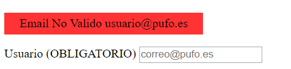

# Formulario

1.El Nombre y el usuario es obligatorio y entre 2 y 15 caracteres

2.Usuario debe ser válido LoQuesea@pufo.es

3.Trabajo y jefe un despegable

4.Fecha superior a la 2000 e inferior o igual a la actual

5.Teléfono de 9 digitos y empezar por 6 o 7

6.Salario superior a 858,55 e inferior a 12000

7. Contraseña de al menos ocho caracteres y contener al menos una letra minúscula, una mayúscula, un número y un símbolo

8.Una vez regitrado nos logueamos

9.Cerrarmos en navegador y lo volvemos ha abrir y comprobamos que la cookie sigue existiendo

10.Cerramos la sesion

11.Comprobamos que se ha borrado la cookie

